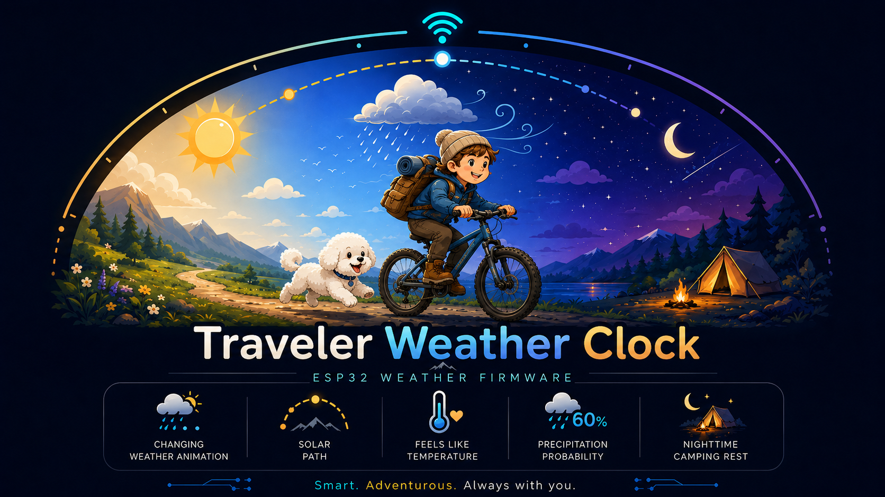
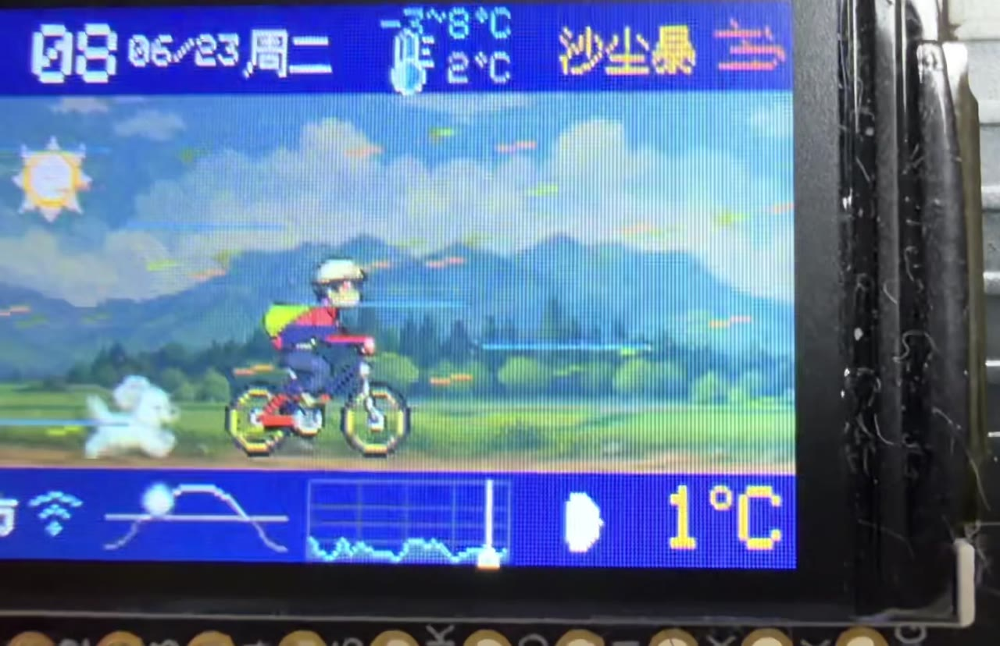
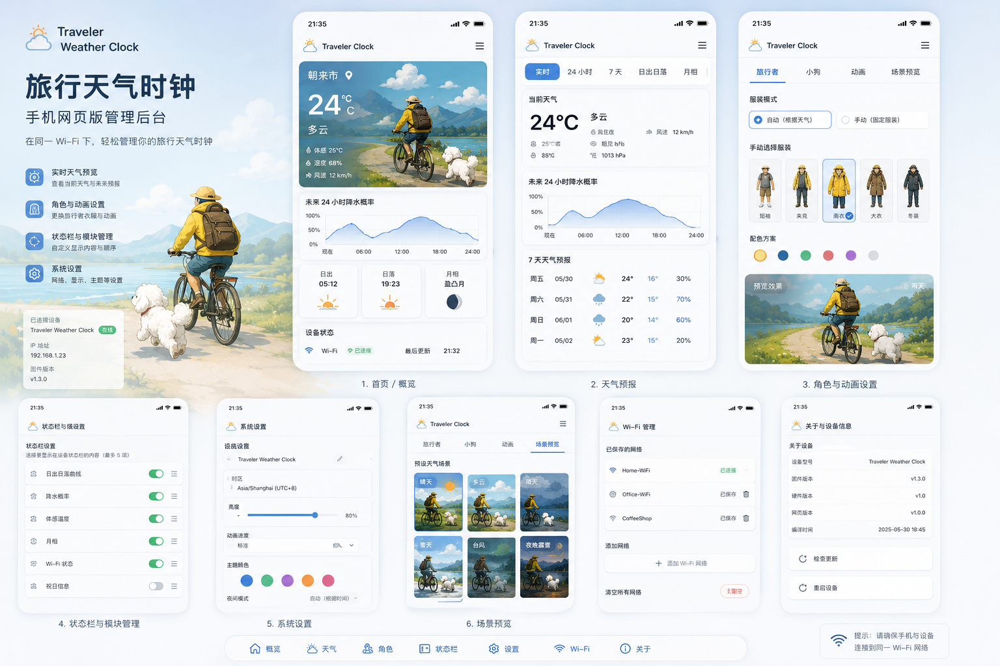

# Traveler Weather Clock 2.0 · 旅行天气时钟

<p align="center">
  <a href="./README.md">简体中文</a> ·
  <a href="./README_EN.md">English</a> ·
  <a href="./README_JA.md">日本語</a> ·
  <a href="./docs/archive/README_v1.md">旧版 README</a>
</p>

<p align="center">
  
  
  
  
</p>

<p align="center">
  
</p>

<p align="center">
  <strong>一台会旅行、会看天气、会昼夜更替、还有小狗陪伴的 ESP32-S3 动漫天气时钟。</strong>
</p>

---

## 演示视频

> GitHub 对 README 内嵌视频支持不稳定，因此这里使用“点击封面打开视频”的方式，手机和电脑端都更可靠。

<p align="center">
  <a href="https://pullead.github.io/Traveler-Weather-Clock/demo.html">
    
  </a>
</p>

<p align="center">
  <a href="https://pullead.github.io/Traveler-Weather-Clock/demo.html">▶ 点击打开网页播放器</a>
  ·
  <a href="https://github.com/pullead/Traveler-Weather-Clock/raw/refs/heads/main/docs/assets/demo.mp4">备用下载/播放</a>
</p>

---

## 项目简介

Traveler Weather Clock 2.0 是一个基于 ESP32-S3 TFT 开发板的旅行主题天气时钟固件。它不只是显示时间和天气，而是把实时天气、日出日落、月相、降水概率、节假日、Wi-Fi 状态和动画场景融合成一个 2D 横版旅行世界：旅行者骑着自行车前进，白色比熊犬快乐地跟在后面，背景和泥路循环滚动；到了深夜，旅行者会在帐篷旁休息，小狗守在旁边，篝火轻轻闪动。

默认地点为日本兵库县朝来市，并使用网络时间与在线天气数据自动驱动画面。

---

## 2.0 亮点

| 模块 | 功能 |
| --- | --- |
| 动漫旅行场景 | 2D 横版骑行、泥路与远景滚动、草丛变化、昼夜明暗过渡 |
| 实时天气动画 | 晴、多云、阴、雨、雪、雨夹雪、雷雨、台风、强风、雾霾等天气效果 |
| 天文同步 | 根据朝来市日出日落、太阳高度、月相与月亮轨迹绘制天空元素 |
| 状态栏组件 | 时间、日期、天气文字与图标、温度范围、体感温度、Wi-Fi、日本祝日、太阳轨迹、降水概率、月相、当前气温 |
| 小狗伙伴 | 白色毛茸茸比熊犬白天奔跑、夜间在帐篷旁守护 |
| 随机场景预览 | 短按 BOOT 随机切换天气 + 昼夜 + 动画组合，双击恢复实时天气 |
| 多 Wi-Fi 记忆 | 连接过的家庭、公司等 Wi-Fi 会保存，开机自动匹配可用网络 |
| 手机网页后台 | 同一 Wi-Fi 下通过手机浏览器管理天气、角色、动画、状态栏、Wi-Fi 和系统设置 |
| 开机画面 | 专属 Traveler Weather Clock 2.0 启动画面 |

---

## 手机网页管理后台

<p align="center">
  
</p>

手机与开发板连接到同一个 Wi-Fi 后，可以打开：

- `http://travel-clock.local`
- 或开发板屏幕/串口显示的局域网 IP，例如 `http://192.168.0.100`

后台包含：

- 首页概览：开机画面、当前天气、24 小时降水概率、日出日落、月相、设备状态
- 天气预报：实时天气、24 小时、7 天、日出日落、月相
- 角色设置：旅行者服装、小狗毛色/速度/夜间亮度、动画速度、场景预览
- 状态栏管理：开启/关闭并排序 Wi-Fi、祝日、太阳轨迹、降水概率、体感温度、月相等模块
- 系统设置：亮度、主题色、动画速度、夜间模式、重启设备
- Wi-Fi 管理：添加、删除、清空已保存网络

设置会写入 ESP32 的 NVS/Preferences，重启后会自动加载上次保存的参数。

---

## 默认地点与数据来源

- 默认地点：日本兵库县朝来市
- 时区：Asia/Tokyo / JST
- 天气数据：Open-Meteo
- 日本祝日：holidays-jp
- 时间同步：NTP
- 月相与太阳/月亮位置：固件内置天文计算 + 网络时间

---

## 硬件

当前 2.0 固件主要适配：

- Adafruit Feather ESP32-S3 TFT
- 240 × 135 ST7789 TFT 屏幕
- ESP32-S3 Wi-Fi
- BOOT 按键

也可以移植到其他 ESP32-S3 + TFT 屏幕，但需要调整屏幕驱动、引脚和分辨率布局。

---

## 快速开始

### 1. 安装 Arduino CLI 与 ESP32 开发板支持

如果你已经可以编译/烧录 ESP32-S3，可以跳过这一步。

### 2. 编译 2.0 固件

```bash
arduino-cli compile \
  --fqbn esp32:esp32:adafruit_feather_esp32s3_tft \
  firmware/TravelWeatherClockV2
```

### 3. 烧录到开发板

将开发板进入下载模式后执行：

```bash
arduino-cli upload \
  --fqbn esp32:esp32:adafruit_feather_esp32s3_tft \
  --port /dev/cu.usbmodem1101 \
  firmware/TravelWeatherClockV2
```

如果你的串口不是 `/dev/cu.usbmodem1101`，请替换为实际端口。

### 4. 首次连接 Wi-Fi

首次启动或清空 Wi-Fi 后，设备会进入配网流程。根据屏幕提示连接设备热点，或打开：

```text
http://192.168.4.1
```

选择 Wi-Fi 并输入密码后，设备会保存该网络。以后在家、公司等已连接过的网络之间移动时，开机后会自动尝试连接保存过的 Wi-Fi。

---

## BOOT 按键

| 操作 | 效果 |
| --- | --- |
| 单击 | 随机切换一个天气 + 昼夜 + 场景动画组合 |
| 双击 | 恢复当前真实时间与实时天气 |
| 长按约 4 秒 | 清空 Wi-Fi 配置 |

随机预览模式会同时切换旅行者服装、天气动画、降水概率曲线和白天小鸟等场景元素；恢复实时模式后，会重新回到朝来市当前天气与时间。

---

## 项目结构

```text
weather-micro-station/
├── README.md                         # 中文项目主页
├── README_EN.md                      # English README
├── README_JA.md                      # 日本語 README
├── docs/
│   ├── assets/
│   │   ├── startup-screen.png        # 2.0 开机画面
│   │   ├── mobile-admin-ui.png       # 手机网页后台展示图
│   │   ├── demo-cover.jpg            # 演示视频封面
│   │   └── demo.mp4                  # 演示视频
│   ├── demo.html                     # GitHub Pages 视频播放器
│   ├── index.html                    # GitHub Pages 入口
│   └── archive/
│       └── README_v1.md              # 旧版项目说明归档
├── firmware/
│   └── TravelWeatherClockV2/         # 2.0 Arduino 固件
├── include/                          # 字体与图标资源
├── src/                              # 原版 PlatformIO 代码
└── tools/                            # 辅助脚本
```

---

## 保留旧版本说明的方法

本仓库采用两种方式保留旧版项目说明：

1. Git 历史天然保留旧 README，可以通过提交历史查看。
2. 当前仓库额外提供归档文件：[docs/archive/README_v1.md](./docs/archive/README_v1.md)，用户无需翻 Git 历史也能打开旧版说明。

如果后续发布正式版本，建议再创建 GitHub Release / Tag，例如 `v1.x` 和 `v2.0.0`，这样旧版固件和说明也能更清晰地固定下来。

---

## GitHub 多语言说明

GitHub README 不允许执行自定义 JavaScript，因此无法在同一个 Markdown 页面里做真正的“无刷新自动切换语言”。本项目采用开源项目最常见、最稳定的做法：在顶部提供三个语言按钮，分别跳转到：

- [简体中文](./README.md)
- [English](./README_EN.md)
- [日本語](./README_JA.md)

每种语言版本都包含项目图片与演示视频入口。

---

## 致谢

本项目最初基于 sfrechette/weather-micro-station 的天气时钟思路继续扩展，并围绕 ESP32-S3、中文界面、旅行主题动画、手机网页后台和朝来市实时天气进行了深度改造。

天气数据与节假日数据分别由 Open-Meteo 与 holidays-jp 提供。

---

## License

MIT License. See [LICENSE](./LICENSE).
