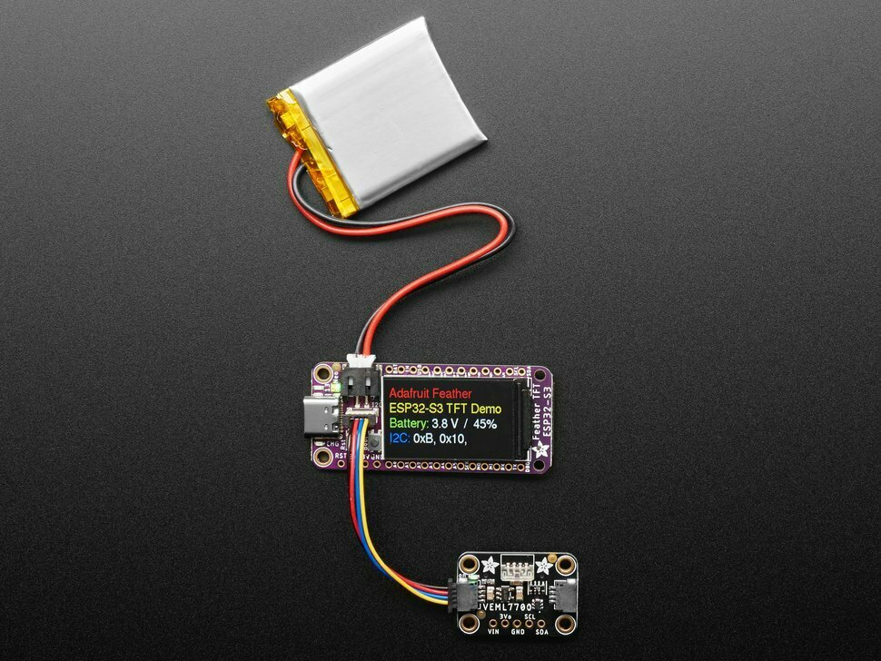

# Traveler Weather Clock

> A compact ESP32-S3 weather clock for travelers, built around the Adafruit Feather ESP32-S3 TFT.

<p align="center">
  
</p>

<p align="center">
  
  
  
  
  
</p>

## Overview

Traveler Weather Clock is a small Wi-Fi connected information display designed for travel scenarios. It combines network time, weather data, battery-powered operation, and a compact TFT dashboard on an ESP32-S3 board.

The current repository documents the hardware target, recovered firmware layout, metadata analysis tooling, and development notes for rebuilding or extending the project.

## What It Does

| Area | Description |
|---|---|
| Clock | Shows time, date, and likely time-zone oriented travel information. |
| Weather | Displays weather condition, temperature, and update state from an online source. |
| Display | Uses the onboard 240 × 135 ST7789 TFT for a compact dashboard UI. |
| Connectivity | Uses ESP32-S3 Wi-Fi for time synchronization and weather updates. |
| Portable Power | Supports USB-C and LiPo battery operation. |
| Maintenance | Includes a UF2-related firmware image, suggesting a recovery or update path. |

## Hardware Target

| Component | Detail |
|---|---|
| Board | Adafruit Feather ESP32-S3 TFT |
| PlatformIO ID | `adafruit_feather_esp32s3_tft` |
| MCU | ESP32-S3, dual-core, 240 MHz |
| Wireless | 2.4 GHz Wi-Fi + Bluetooth LE |
| Flash | 4 MB |
| PSRAM | 2 MB |
| Display | 1.14 inch 240 × 135 ST7789 TFT |
| USB | Native USB-C, USB-Serial/JTAG |
| Expansion | Feather headers + STEMMA QT / Qwiic I2C |

See [hardware notes](../hardware.md) for pin and interface notes.

## Firmware Layout

The analyzed Flash image uses a 4 MB layout:

| Partition | Type | Offset | Size | Role |
|---|---|---:|---:|---|
| `nvs` | data/nvs | `0x009000` | `0x5000` | Configuration storage |
| `otadata` | data/ota | `0x00E000` | `0x2000` | OTA boot state |
| `ota_0` | app/ota_0 | `0x010000` | `0x2C0000` | Main application |
| `uf2` | app/factory | `0x2D0000` | `0x40000` | UF2 maintenance/recovery image |
| `ffat` | data/fat | `0x310000` | `0xF0000` | Application file system |

Application metadata:

| Image | Project | Version | Build | ESP-IDF |
|---|---|---|---|---|
| `ota_0` | `arduino-lib-builder` | `43a8f6d` | `Jun 2 2026 11:17:54` | `v5.5.4` |
| `uf2` | `tinyuf2` | `0.35.0` | `Jul 3 2025 10:50:48` | `v5.3.2` |

More details:

- [Product analysis](../product-analysis.md)
- [Firmware analysis](../firmware-analysis.md)
- [Partition map](../partition-map.md)

## Repository Layout

```text
.
├── assets/
│   └── traveler-weather-clock-hero.png
├── docs/
│   ├── backup-and-restore.md
│   ├── firmware-analysis.md
│   ├── hardware.md
│   ├── partition-map.md
│   └── product-analysis.md
├── tests/
│   └── test_analyze_flash_metadata.py
├── tools/
│   └── analyze_flash_metadata.py
└── README.md
```

## Metadata Tool

The included Python tool reads ESP32 Flash structure and app-image metadata.

Markdown output:

```powershell
python tools\analyze_flash_metadata.py path\to\flash-backup.bin --format markdown
```

JSON output:

```powershell
python tools\analyze_flash_metadata.py path\to\flash-backup.bin
```

## Tests

```powershell
python -m unittest discover -s tests -v
```

## Next Development Ideas

- Build a fresh TFT dashboard UI.
- Add weather provider integration.
- Add travel city or time-zone switching.
- Add Wi-Fi setup and configuration flow.
- Add battery status and low-power behavior.
- Explore UF2 or serial maintenance workflows.

## License

MIT
